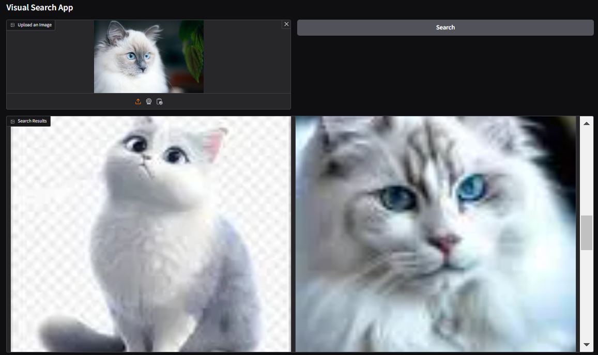

# Visual Search App 🚀

Welcome to the **Visual Search App**! This project allows users to search for similar images by simply uploading a picture. Powered by **transformers** and **computer vision**, it generates captions for your images and performs a Google image search based on the text to find matching visuals.

### 🔧 Technologies Used:
- **Hugging Face Transformers** (BLIP for image captioning)
- **Google Image Search** (scraping with BeautifulSoup)
- **Gradio** (interactive UI)

### 🎯 Features:
- Upload an image 📸
- Get a caption describing the image 📝
- Find similar images on Google using the caption 🔍
- Interactive web interface powered by Gradio ⚡

### 🚀 How It Works:
1. **Image Upload**: Upload any image and let the magic happen.
2. **Image Captioning**: The app uses a pre-trained image captioning model (BLIP) to generate a description of your image.
3. **Image Search**: The generated caption is used to perform a Google image search to find visually similar images.
4. **Results**: View the search results in a beautiful gallery format.

### 🛠️ Getting Started:
1. Clone the repo:
   ```bash
   git clone https://github.com/visha1Sagar/Practice.git
   ```
2. Move to Visual Search App Folder, create .env file with HF_Token

3. Install the required dependencies:
   ```bash
   pip install -r requirements.txt
   ```
4. Run the notebook:
   ```bash
   jupyter notebook main.ipynb
   ```

### 📸 Demo:
Check out the app in action by running the notebook and uploading your own image!

### Example:
